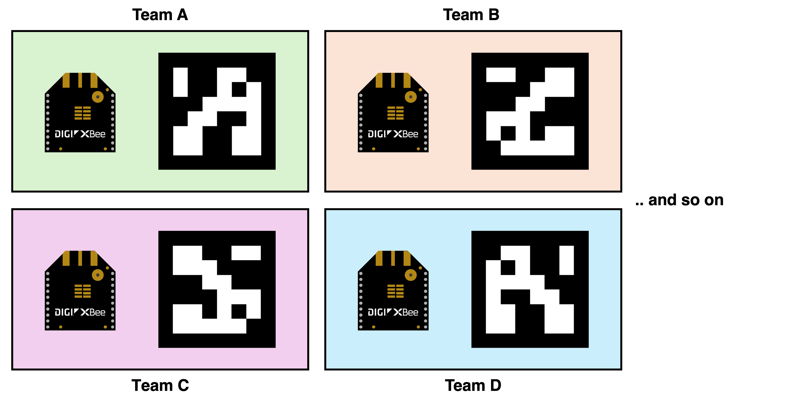
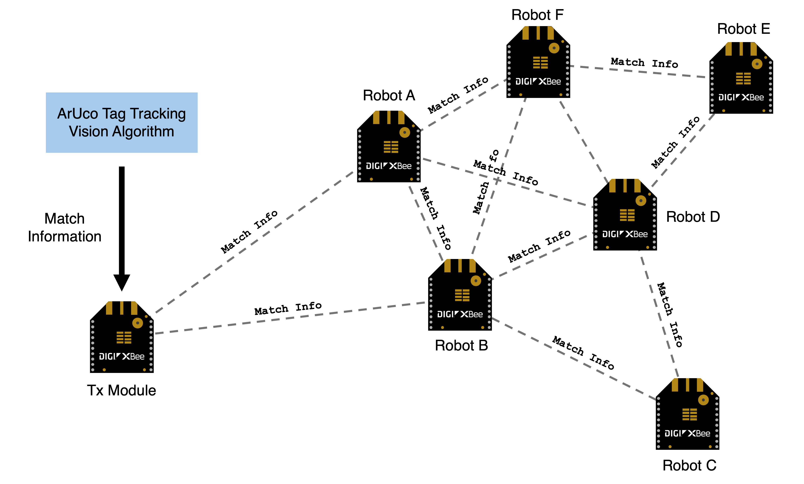
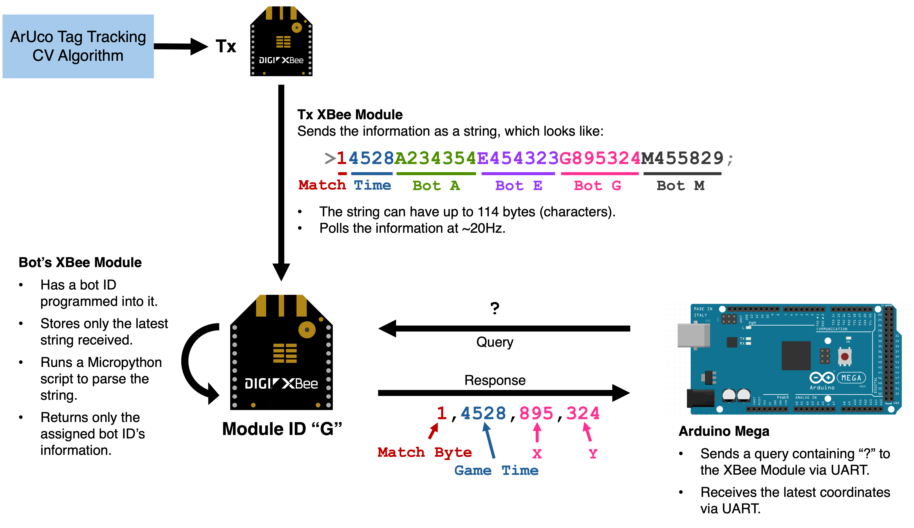
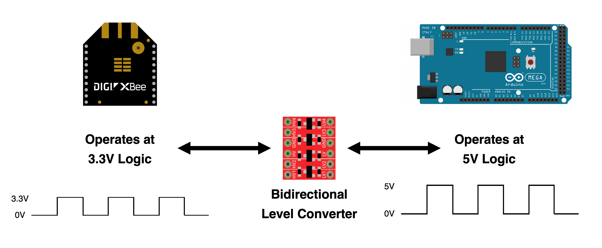
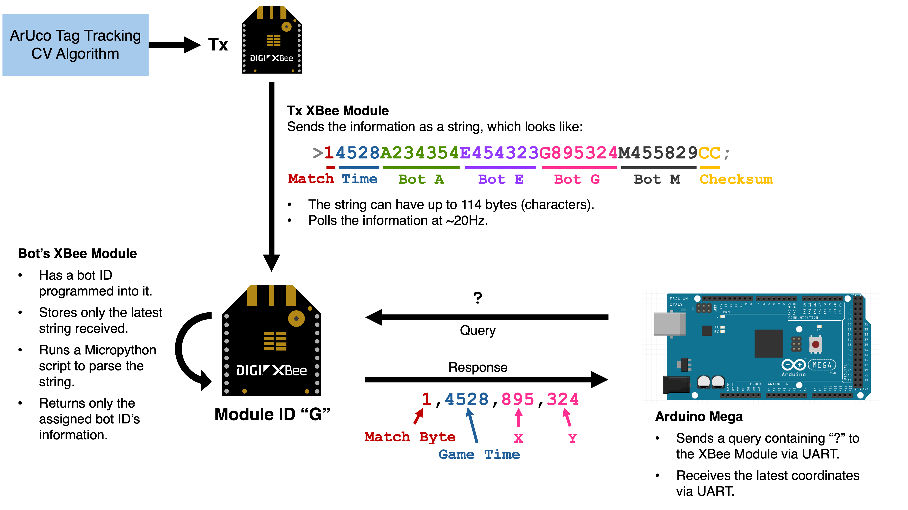

# jHockey Robot Tracking and Communications Setup

### Mechatronics, Spring 2024

*Last updated by Anway Pimpalkar, March 21st 2024*

> *Sample code, PCB Layouts and CAD available at https://github.com/anwaypimpalkar/jhockey-tracking*

## Overview

For the hockey robots you are constructing for your final project, it is essential to know the robot's exact location at any given time to determine the correct orientation and movements for approaching and shooting towards the goal. To simplify your project, we have constructed the tracking system for you.

This system tracks ArUco tags on top of each robot using a computer vision algorithm and sends each robot its coordinates using a ZigBee protocol.

## Robot Tracking - ArUco Tags, Computer Vision

Each robot is assigned a unique ArUco tag and a corresponding alphabetical ID (A, B, C, D, etc.). These tags are tracked using a computer vision (CV) algorithm developed by Naveed Riaziat, which captures the X and Y coordinates of the robot in centimeters. The tracking system runs on a JeVois Smart Machine Vision Camera connected to a Raspberry Pi.

> The unique IDs are specific to each ArUco tag and XBee module; therefore, you must keep them paired together.

You can learn more about ArUco tags and tracking algorithms at https://docs.opencv.org/4.x/d5/dae/tutorial_aruco_detection.html

## Communications - ZigBee Protocol

The coordinates found by the CV algorithm are relayed to your robot using ZigBee.

### What is ZigBee?

ZigBee is a high-level communication protocol used to create personal area networks with small, low-power digital radios. It is particularly suited for applications where power consumption is a critical factor, such as in wireless sensor networks and home automation devices. ZigBee operates on the IEEE 802.15.4 specification and is designed to provide secure and reliable wireless data transmission at low data rates. 

You can check out this resource for a more detailed overview of ZigBee: https://www.geeksforgeeks.org/introduction-of-zigbee/

### Basic Network Architecture

ZigBee modules (called XBees) can mesh together to form a  network where each node can transmit and relay data to other nodes. This meshing capability allows for extended range and redundancy, as data can find multiple paths to reach its destination. The dynamic nature of ZigBee mesh networks ensures that if one node fails, data can be rerouted through other nodes, enhancing network reliability.

### How does it work for our jHockey setup?

#### Sending the Match Information

In our setup, the CV algorithm supplies the robot tracking information to the Raspberry Pi, which then broadcasts the match information via a XBee 3 Tx module to all receiver nodes on the same Personal Area Network (PAN) channel.

The locations of all the robots on the arena are sent within the same packet. The match information consists of the following information:

- `>` Start (1 byte).
- `Match Byte` Binary (0/1) indicating whether a match is ongoing (1 byte).
- `Time` Match time in seconds, represented as 4 bytes.
- `Robot #1 ID` Alphabet corresponding to the first robot's ArUco tag (1 byte).
- `Robot #1 X Coord` First robot's X coordinate in centimeters (3 bytes).
- `Robot #1 Y Coord` First robot's Y coordinate in centimeters (3 bytes).
- `Robot #2 ID` Alphabet corresponding to the second robot's ArUco tag (1 byte).
- `Robot #2 ID X Coord` Second robot's X coordinate in centimeters (3 bytes).
- `Robot #2 ID Y Coord` Second robot's Y coordinate in centimeters (3 bytes).
- `...`
- `;` End (1 byte).

This information is sent to all the XBee 3 modules as a string, as shown in the figure above. 

> XBee 3 Module Datasheet: https://www.digi.com/resources/documentation/digidocs/pdfs/90001543.pdf

#### Receiving and Processing the Match Information

The XBee modules have an inbuilt processor on them, capable of running Micropython scripts. We have flashed a script which processes the match information, and only returns selected information back to your Arduino-based robot. The script has a predefined `Robot ID`, and parses the string for information pertaining to that particular ID. 

The output from the module after parsing the string is a comma-delimited string, which looks like  `M,TTTT,X,Y`.

- If there is no information for the bot available in the message, it returns `no tracking information available`.
- If the ZigBee module is not receiving any information at all, it returns `no active tx found`.

#### Interfacing the XBee Module with an Arduino

The Arduino and XBee module communicate via a UART protocol. On an Arduino Mega, four hardware serial lines are available for UART communication. One of these is used to establish communication with our computer, and a second one is utilized for XBee communication.

XBee modules operate with 3.3V digital logic, while the Arduino Mega operates at 5V digital logic. Therefore, it is necessary to convert the logic voltage levels between these devices to ensure proper transmission. For this task, we use a bidirectional level converter, as illustrated in the figure below.

> Bidirectional Level Converter Link: https://www.sparkfun.com/products/12009
> 
> Bidirectional Level Converter Datasheet: https://cdn.sparkfun.com/datasheets/BreakoutBoards/BSS138.pdf

The circuitry for this has been condensed into a printed circuit board (PCB) for your convenience, on which you will only need to mount the respective components. Below, you will find a sample connection diagram that corresponds to the provided sample code. If necessary, you can change the hardware serial ports.

> *PCB files available at https://github.com/anwaypimpalkar/jhockey-tracking/tree/main/pcb*

The `DOUT` and `DIN` labels on the PCB corresponds to the respective pins on the XBee module. You can learn more about them in the XBee 3 Datasheet. 

#### Talking with the XBee Module

The XBee module communicates with the Arduino via UART. To send a location query, you must transmit a `?` character to the XBee module, which will then respond with the latest coordinate information in the comma-delimited format previously mentioned.

> *Sample code available at https://github.com/anwaypimpalkar/jhockey-tracking/tree/main/xbee_sample_code*